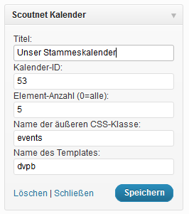

# Scoutnet Kalender

Ein WordPress-Plugin, das Termine aus dem [Scoutnet-Kalender](https://www.scoutnet.de/kalender/start) anzeigt.

Scoutnet bietet den deutschen RDP-Pfadfinderverbänden (DPSG, BDP, PSG, BMPPD, VCP) ein zentrales und hirarchisches Kalender-System an. Die Nutzung ist natürlich freiwillig, aber überaus praktisch. Scoutnet-Termine lassen sich, beispielsweise, in allen Apps anzeigen und verwalten (Outlook, Thunderbird, Android, iOS, ...).

Dieses Plugin ermöglicht die Darstellung von Scoutnet-Terminen innerhalb von WordPress Seiten und Beiträgen. Mit Shortcodes können verschiedene Daten angezeigt werden und man kann die Ausgabe mit eigenen Templates formatieren. Alle Ansichten bringen kommentierte Vorlagen mit. Es sind keine iFrames, iCAL-Exporte, oder umständliche Datenkonverteierung notwendig, alle Daten werden in Echzeit von der Scoutnet API geladen.

Ursprünglich gebaut und angepasst von: muetze, derweed, lordq, okay75

# Features

* Verbandsunabhängig (VCP/DPSG/BDP/BMPPD/PSG)
* Templates zur einfachen Anpassung
* Beliebige Daten eines Termins können angezeigt werden
* Widget mit asynchroner Aktualisierung
* API-Proxy in Einstellungen konfigurierbar
  * Für Plastikhoster die kein ausgehendes SSL erlauben (thx Andre)

#  Installation

1. Den Ordner "scoutnet-kalender" mit allen Dateien in das Pluginverzeichnis (/wp-content/plugins/) hochladen
2. Das Plugin im WordPress-Dashboard unter Plugins -> "Scoutnet Kalender" aktivieren

- Das Widget kannst du dann sofort unter Design->Widgets in dein Theme einbinden, wenn dein Theme Widgets unterstützt
- Für Seiten und Beiträge gibt es einen Shortcode
- Unter 'Einstellungen' kannst du Standartwerte vorgeben und die Shortcodes nachschlagen.

# Frequently Asked Questions

- Warum ist das Plugin nicht mehr im WordPress Repository?
  - Weil es früher ungeprüft HTML vom Scoutnet-Server eingebunden hat
- Das Plugin funktioniert bei meinem Hoster nicht
  - Hostingangebote von Strato, 1blu, 1und1, Unitedinternet und andere (scherzhaft "Plastikhoster" genannt) unterbinden gerne ausgehende Verbindungen zu API-Diensten. Wechsle den Hoster (zum Beispiel zur [DATA-systems](https://www.data-systems.de) oder nutze die Proxy-Funktion in den Einstellungen.
- Kalender-ID?!?
  - Jeder Kalender hat eine numerische ID. Mehr Informationen unter: http://www.scoutnet.de/kalender/kurzanleitung.html
- Kann ich mir das Plugin Live ansehen?
  - Serh viele Verbände nutzen WordPress, die meisten davon auch dieses Plugin. Zum Beispiel die [DPSG im Diözesanverband Paderborn](http://www.dpsg-paderborn.de)
- Kann ich Termine aus mehreren Kalendern anzeigen?
  - Trage in deine Seite in den Shortcode die IDs getrennt durch Kommata ein: `[snk elementcount="5" ssid="3,4,5" /]`
- Das Widget funktioniert nicht, ich sehe nur den Ladehinweis!
  - Schau nach ob du ein Speed- oder Caching-Plugin im Einsatz hast, das "JS-Minify" nutzt oder die Seite anders "Manipuliert". Schalte die das minify/process fuer alle Seiten mit dem Widget aus.

# Eigenes Template für custom HTML/CSS

1. Kopiere dein Template `scoutnet-kalender_[inline|widget]_kalender_EXAMPLE_list.php` von scoutnet-kalender/templates/ in dein Theme-Verzeichnis
2. Benenne das Template um, z.B. `scoutnet-kalender_inline_kalender_STAMMTEETRINKER_list.php`
3. Trage `STAMMTEETRINKER` (passende Klein-Grosschreibung) in das Widget/Shortcode ein. Zum Beispiel `[snk elementcount="30" externalTemplateName="STAMMTEETRINKER" ssid="53" /]`
4. Füge das CSS aus der EXAMPLE_style.css in deine eigene "style.css" ein oder ergänze das Template um dein CSS

Du kannst diese Dateien nun in deinem Theme-Ordner bearbeiten, ohne das sie bei einem Update des Plugins überschrieben werden.

# Screenshots

Die Widget-Konfiguration

Widget mit dem EXAMPLE-Template

# Changelog

= 1.3 =
- Update für PHP 8.1/8.2
- HTML-Escaping für remote-Content eingebaut

= 1.1.2 =
- Aktuelle Wordpress-Versionen getestet
- WordpressMU getestet
- Readme angepasst
- Pizza gegessen

= 1.0.9 =
- Readme um Proxy-Settings erweitert
- Proxy-Settings Fehler in den optionen behoben

= 1.0.8 =
- Typos
- Compatibility-Test WP 4.5.1

= 1.0.7 =
- Option zur Nutzung von Proxy-Servern hinzugefuegt (Danke André aus Bremen)
- API um Proxy-Variablen erweitert
- Noch mehr Tippfehler korrigiert
- Kompatibilitaet zu Wordpress 4.6

= 1.0.6 =
- Readme-Markup, no code Changes

= 1.0.4 =
- Fix: URLs to Scoutnet.de work now correctly

= 1.0.3 =
- Fix: Kommentar-Ausbau, Wordpress-Updatefehlersuche (das Repository mochte nicht)

= 0.2.5 =
- Fix: Tippfehler, Commit-Fehler

= 0.2.5 =
- Fix: Readme Tippfehler
- Fix: Falscher Pfad in ABSURL

= 0.2.4 =
- Fix: Falsche Ausgabe-Uhrzeit in Inline-Template (Danke Maxi)
- Change: Das Inline-Template EXAMPLE gibt jetzt anstatt 1970 als aenderungsdatum das Erstellungsdatum des Termins aus. Macht mehr Sinn (Danke Maxi)

= 0.2.2 =
- Fix: Readme angepasst, neue Release korrekt getaggt
- Fix: Tippfehler ohne Ende korrigiert
- Fix: Anpassung Doku

= 0.2.1 =
- Fix: Verwendung von "get_stylesheet_directory()" anstelle von "TEMPLATEPATH" fpr die Unterstuetzung von Child-Themes (Danke Tobi)
- Feature: Anpassung der Datenuebernahme fuer mehrere Kalender (z.B. Bezirkskalender und alle Stammeskalender) (Danke Tobi)

= 0.2.0 =
- Fix: Cleanup (doppelte Dateien entfernt)
- Feature: Template(s) deutlich verbessert (thx Fl!P, phil)
- Feature: URL-Verkuerzung in Inline-Template hinzugefuegt

= 0.1.9 =
- Fix: Termine im Widget sind um eine oder Zwei Stunden verschoben.

= 0.1.8 =
- Fix: CURL-Fehler in safe_mode PHP-Konfigurationen behoben

= 0.1.7b =
- Fix: Readme Markup fixes. Daemliche Umlaute.

= 0.1.7 =
- Erste "offizielle" Release
- Templates hinzugefuegt
- AJAX aktualisierung gegen "Stotterpages" gebaut
- Bugfixes
- Template-Bugfixes

= 0.0.1 =
* Code von muetze bekommen :)